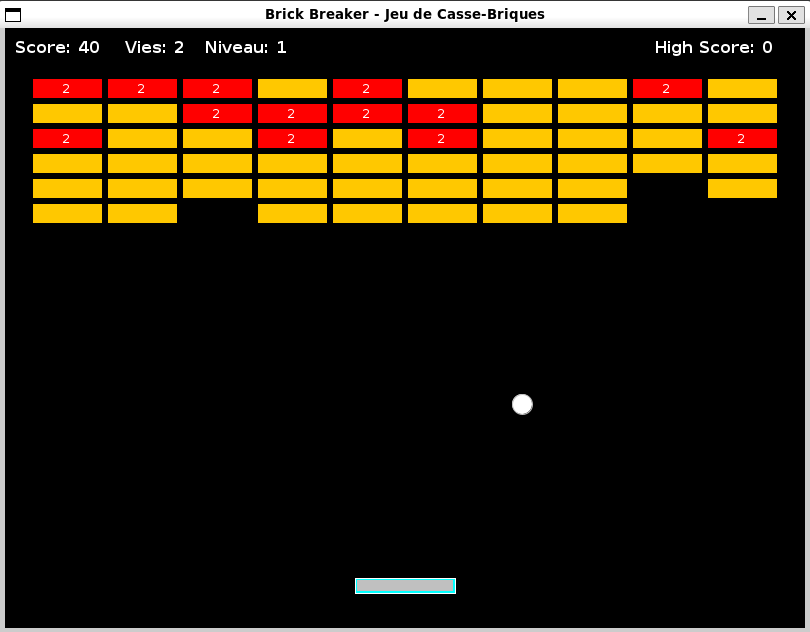

# Brick Breaker Game



Un jeu classique de casse-briques développé en Java.

## Description

Ce projet implémente le jeu classique Brick Breaker où le joueur contrôle une raquette pour faire rebondir une balle et détruire des briques.

## Fonctionnalités

- Interface graphique interactive
- Contrôles de raquette fluides
- Physique de collision réaliste
- Système de score
- Niveaux progressifs

## Prérequis

- Java 8 ou version supérieure
- IDE Java (IntelliJ IDEA, Eclipse, ou VS Code)

## Installation

1. Clonez le repository
2. Ouvrez le projet dans votre IDE Java préféré
3. Compilez et exécutez le projet

## Comment jouer

- Utilisez les flèches gauche/droite ou les touches A/D pour déplacer la raquette
- Empêchez la balle de tomber en bas de l'écran
- Détruisez toutes les briques pour passer au niveau suivant

## Structure du projet

```
src/
├── main/
│   └── java/
│       └── [fichiers source Java]
└── test/
    └── java/
        └── [tests unitaires]
```

## Contribution

Les contributions sont les bienvenues ! N'hésitez pas à ouvrir une issue ou soumettre une pull request.

## Auteur

Développé avec ❤️ en Java par @cheikhn414